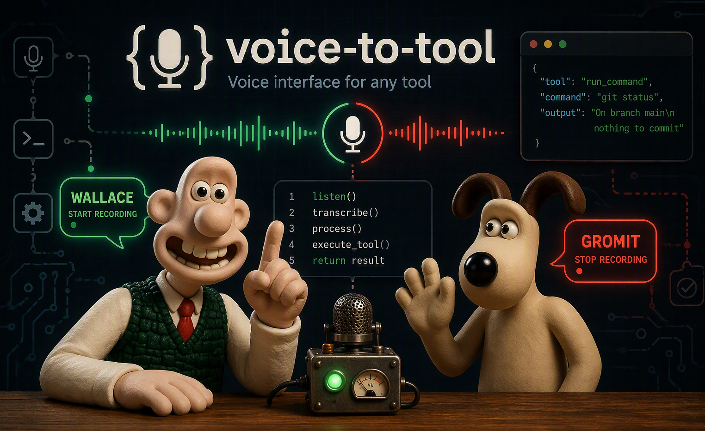

# Wallace & Gromit

Say "wallace" to start recording, "gromit" to stop. Whatever you say gets transcribed,
structured, and — after you review it — created as a Jira ticket, a macOS Note, or
routed to any other agent you plug in. A local LLM decides which
destination fits based on what you actually said. Jira and Notes are just the two
built-in agents — the architecture supports adding as many as you like.

1. **Transcribe** — MLX Whisper, on-device
2. **Structure** — Ollama extracts title/description/type/priority/labels and classifies
   ticket vs. note
3. **Create** — Jira REST API v3, or Notes.app via AppleScript

Nothing leaves your machine except the Jira API call.

### Voice activation (`voice_listener.py`)

No hotkey — the mic just stays open. A poll loop checks the last ~4s of audio every ~1.5s for
the wake word. Once heard, it records into a separate buffer until the stop word, then hands
that off to the graph.

```
idle, polling for "wallace"
     │
     ▼
recording
     │  ("gromit", or MAX_RECORD_SECONDS hit)
     ▼
transcribe → structure (ticket or note?) → review → create
```

`config/settings.py` has three model slots — `WAKE_LISTEN_MODEL`, `STOP_LISTEN_MODEL`,
`WHISPER_MODEL` — so polling and the final transcription could run different-sized models.
Right now they're all `whisper-small.en-mlx`. Drop `WAKE_LISTEN_MODEL` to something smaller if
idle polling bugs you; keep `STOP_LISTEN_MODEL` accurate, since missing the stop word means
recording runs until the safety cap.

### Graph shape (`graph.py`)

```
                                       ┌─(ticket)─► create_ticket ─┐
START -> transcribe -> structure -> review                        ├─► END
                            \         └─(note)───► create_note ────┘
                             \--(cancel)------------------------------> END
```

`main.py` just starts the listener and hands audio to `ticket_graph.invoke(...)`. State lives
in one `TicketState` dict; routing is conditional edges.

---

## Setup

Requirements: macOS on Apple Silicon, Python 3.10+, [Ollama](https://ollama.com), a Jira Cloud
API token.

```bash
cd voice-to-x
python3 -m venv venv
source venv/bin/activate
pip install -r requirements.txt
```

**Models.** Whisper downloads on first run via Hugging Face — all three model slots currently
point at `whisper-small.en-mlx` (~150MB), so it's one download. Pre-fetch it:

```bash
python3 agents/transcribe.py
```

Ollama needs a model pulled separately:

```bash
ollama pull qwen2.5:7b
```

`qwen2.5:3b` also works and is smaller/faster if you swap `OLLAMA_MODEL`.

**Jira credentials:**

```bash
export JIRA_URL="https://yourcompany.atlassian.net"
export JIRA_EMAIL="you@company.com"
export JIRA_API_TOKEN="your-api-token-here"
```

Put these in `~/.zshrc` so they stick.

**Other knobs in `config/settings.py`:**
- `PROJECT_ALIASES` — spoken project names → Jira project keys
- `WAKE_WORD` / `STOP_WORD` — pick something phonetically distinct from normal speech
- `CHECK_INTERVAL_SECONDS` — polling frequency
- the three Whisper model slots (see above)

`NOTES_FOLDER` in `agents/notes_create.py` sets which Notes.app folder new notes land in
("Notes" by default).

**Permissions:** macOS asks for microphone access on first run, and for Automation access to
Notes the first time a note gets created. Grant both under System Settings → Privacy & Security.

## Running it

```bash
python3 main.py
```

Say "wallace", speak your request, say "gromit". You'll land on a review prompt:

```
PROPOSED TICKET
============================================================
Project:     AUTH
Type:        Bug
Priority:    High
Title:       Fix password reset on mobile
Description: Users are unable to reset their passwords on mobile devices.
Labels:      auth, mobile
============================================================
[Enter]=create  [e]=edit  [c]=cancel:
```

or

```
PROPOSED NOTE
============================================================
Title:       Revisit onboarding flow
Description: We should review and potentially improve the onboarding process next quarter.
============================================================
[Enter]=create  [e]=edit  [c]=cancel:
```

Enter creates it, `e` fixes a field, `c` cancels.

### Running in the background

No hotkey, no keyboard capture, so this runs fine as a launchd agent.

`~/Library/LaunchAgents/com.yourname.voicetox.plist`:

```xml
<?xml version="1.0" encoding="UTF-8"?>
<!DOCTYPE plist PUBLIC "-//Apple//DTD PLIST 1.0//EN" "http://www.apple.com/DTDs/PropertyList-1.0.dtd">
<plist version="1.0">
<dict>
    <key>Label</key>
    <string>com.yourname.voicetox</string>
    <key>ProgramArguments</key>
    <array>
        <string>/full/path/to/voice-to-x/venv/bin/python3</string>
        <string>/full/path/to/voice-to-x/main.py</string>
    </array>
    <key>RunAtLoad</key>
    <true/>
    <key>KeepAlive</key>
    <true/>
    <key>StandardOutPath</key>
    <string>/tmp/voicetox.log</string>
    <key>StandardErrorPath</key>
    <string>/tmp/voicetox.err</string>
    <key>EnvironmentVariables</key>
    <dict>
        <key>JIRA_URL</key>
        <string>https://yourcompany.atlassian.net</string>
        <key>JIRA_EMAIL</key>
        <string>you@company.com</string>
        <key>JIRA_API_TOKEN</key>
        <string>your-api-token-here</string>
    </dict>
</dict>
</plist>
```

```bash
launchctl load ~/Library/LaunchAgents/com.yourname.voicetox.plist
```

Heads up: the review step is a terminal `input()`, so running headless means it just hangs
waiting for input you can't give. Swap `review_node` for something that writes to a file/queue
instead if you want this running unattended.

---

## Project structure

```
voice-to-x/
├── main.py                  # entry point, starts the voice listener
├── voice_listener.py        # continuous mic listener, wake/stop word detection
├── graph.py                 # LangGraph StateGraph wiring the agents together
├── requirements.txt
├── config/
│   └── settings.py          # Jira config, project aliases, wake/stop words, model names
└── agents/
    ├── transcribe.py        # MLX Whisper
    ├── structure.py         # Ollama structuring + ticket/note classification
    ├── jira_create.py       # Jira REST API
    └── notes_create.py      # Notes.app via AppleScript
```

## Notes

- False wake-word triggers happen. The review gate catches them — worst case is a draft you cancel.
- Ticket-vs-note classification isn't perfect on ambiguous phrasing ("note that the login bug
  needs fixing"). Check the heading in the review step and re-record if it guessed wrong.
- Priority field name/values vary by Jira instance — if `create_jira_ticket` errors on it, drop
  that block and set priority manually.
- $0 per run — only the final Jira API call leaves the machine.
